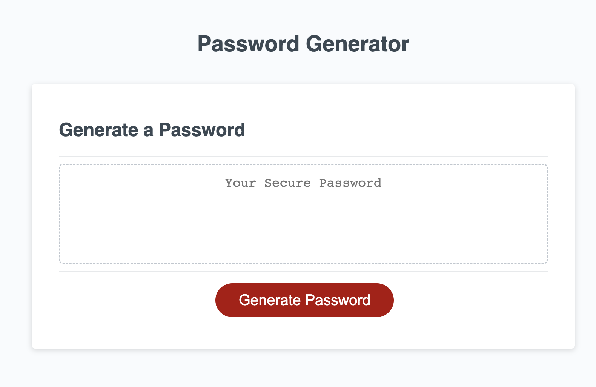

# Password Generator (Module 3)

## Description
This password generator can be used to generate random passwords consisting of lowercase, uppercase, numbers and special characters. It will notify users when they've made an error in requesting a password and has upper and lower limits on password length. Enjoy the security of a random/complex password!

## Table of Contents
- [Usage](#usage)
- [Credits](#credits)
- [Features](#features)
- [Access](#access)

## Usage
- The users clicks "generate password" and answers a series of prompts to include certain types of characters
- Once the user has selected these prompts with the desired inclusions, they input a password length (min 8 char/max 128 char)
- The password is the generated and can me copied from the window

## Credits
This uses the base code from the rock, paper, scissors game written by Manny in class. From there I built in additional logic to hand new features.

## Features
- This app generates a password comprised of lowercase, uppercase, numbers and special characters based on users request
- You can use the password generator to create passwords up to 128 characters and at least 8 characters
- It can be used over and over again!

## Access
Click to view: [Password Generator](https://johnpow.github.io/mod3-password-gen//).